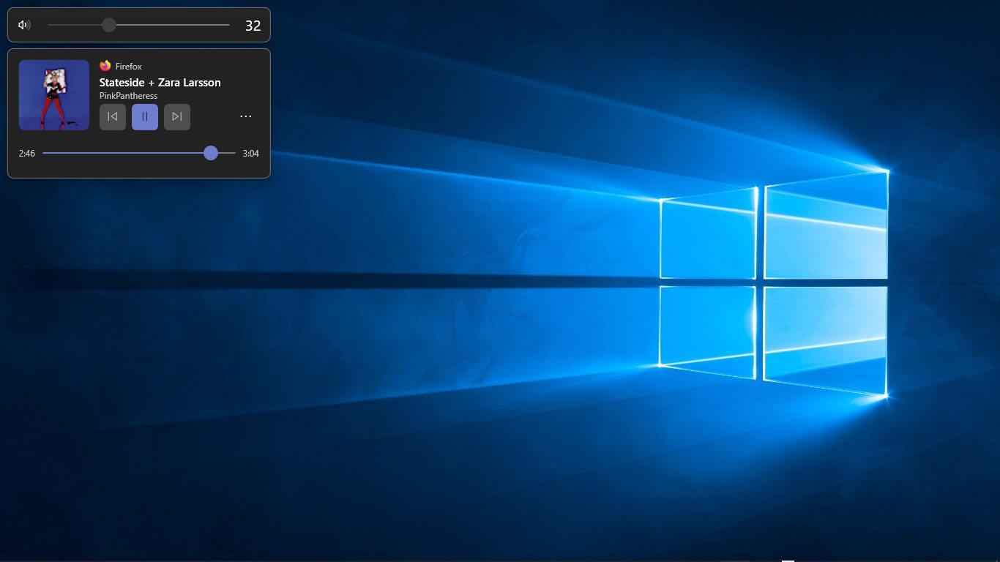
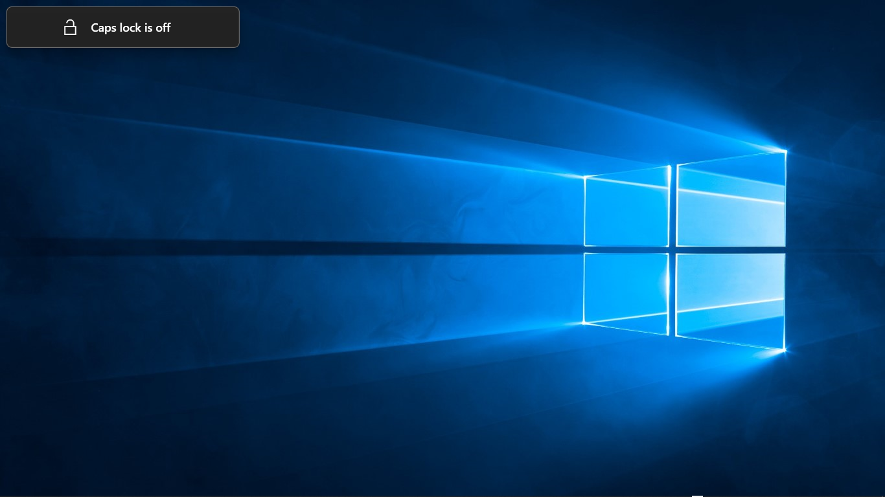

<p align="center">
  
</p>

<h1 align="center">Flylet</h1>

<p align="center">Modern, Fluent-style replacements for the Windows volume, brightness, media and lock-key pop-ups.</p>



Press a volume key and Windows shows its own small pop-up. Flylet hides that one and shows its
own instead: cleaner, with real media controls, and with a song timeline that actually keeps
moving while the music plays.

> Flylet is a maintained continuation of
> [ModernFlyouts](https://github.com/ModernFlyouts-Community/ModernFlyouts), which was archived in
> November 2025. Its original authors and contributors built the foundation of this project, and
> their work is used here under the MIT License. Flylet is not affiliated with them.

## What Flylet replaces

| Pop-up | What Flylet shows |
| --- | --- |
| Volume | A volume slider, plus the media player card when something is playing |
| Media | Album art, title, artist, play/pause, previous/next and a seekable timeline |
| Brightness | A brightness slider, on devices that support it |
| Lock keys | Caps Lock, Num Lock and Scroll Lock state |

It runs from the system tray, can start with Windows, and gets out of the way when you don't
need it.

## What's different from ModernFlyouts

- **The media timeline moves again.** Upstream only updated the song position when playback was
  paused, so the time sat frozen. Flylet estimates the position between reports and keeps
  counting. Sources that stop reporting a real timeline (Firefox, until the first pause) show an
  empty bar instead of a wrong one.
- **Windows 11 works again.** Windows 11 creates its flyout host only after the first volume
  press, and upstream only recognized the Windows 10 window class, so it never hid the new
  pop-up. Flylet recognizes both.
- **A redesigned media flyout:** album art on the left, and the play button and timeline take an
  accent color picked from the album art.
- **Up to date:** .NET 10, current dependencies, built with Visual Studio 2026.
- **Its own name and icon.**

## Requirements

- Windows 10 version 22H2, or Windows 11
- .NET 10 — bundled with the app, nothing to install separately

## Installing

Flylet is heading to the Microsoft Store; this README will link to it once it's published.
Until then, build it yourself.

## Building

You need Visual Studio 2026 with the **.NET desktop** and **C++ desktop** workloads, the
.NET 10 SDK, and Developer Mode turned on.

Build, install and launch a local test copy:

```powershell
tools\dev-install.ps1
```

It installs under a separate identity, "Flylet (Dev)", so it can run next to a Store copy.

Build only:

```powershell
msbuild Flylet.sln /restore /m /p:Configuration=Release /p:Platform=x64 /p:AppxBundle=Never
```

Run the tests:

```powershell
dotnet test Flylet.Core.Tests
```

`tools\make-icons.ps1` regenerates every app and package icon from code.

## How it works

Flylet watches window events on `explorer.exe` to spot the built-in flyout, hides it, and shows
its own window in its place. Media information comes from Windows' Now Playing session
(NPSM), so it works with any app that reports media to Windows.

## Known limits

- Firefox sends Windows a 60x60 album image, so art looks soft for songs played there. Chrome
  sends 120x120. This is on Firefox's side.
- After seeking in Firefox, the song position stays off until the next pause.
- Brightness control is untested on Windows 11.
- x86 and ARM64 builds don't currently build; releases are x64 only for now.

## Settings



## Credits

Flylet exists because of [ModernFlyouts](https://github.com/ModernFlyouts-Community/ModernFlyouts)
and everyone who worked on it, and because of
[ADeltaX](https://github.com/ADeltaX/), whose research made the original possible.
Third-party code and its licenses are listed in [NOTICE.md](NOTICE.md).

## License

[MIT](LICENSE) — the original copyright notice is kept alongside this project's.
